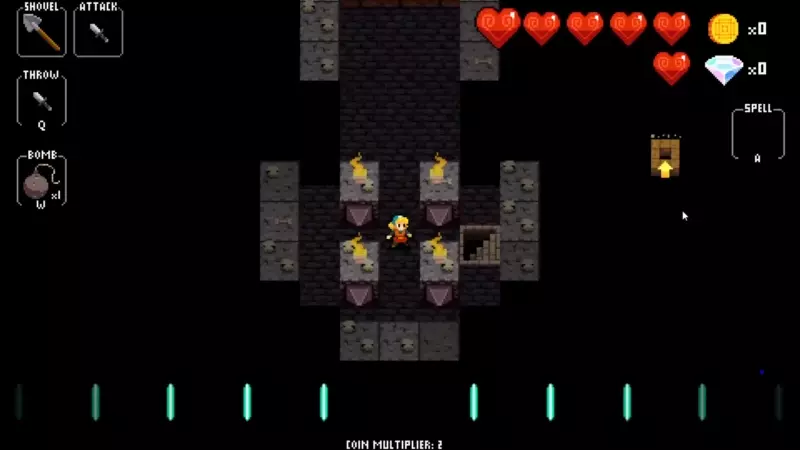
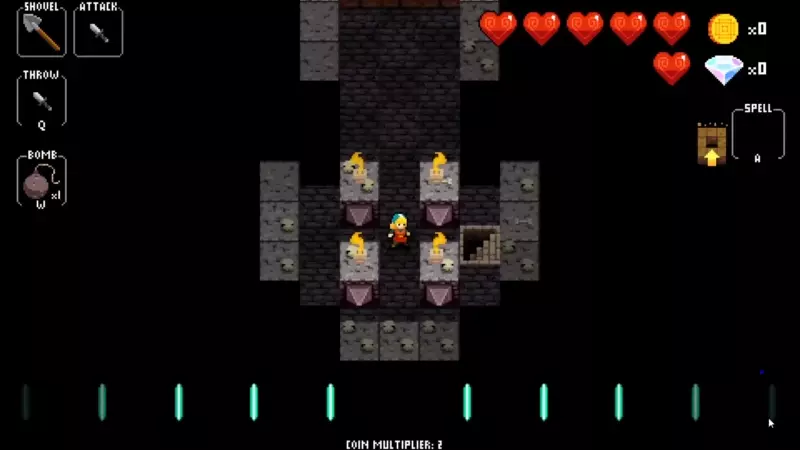
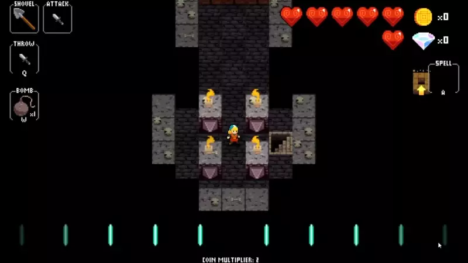
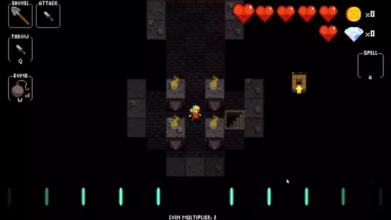
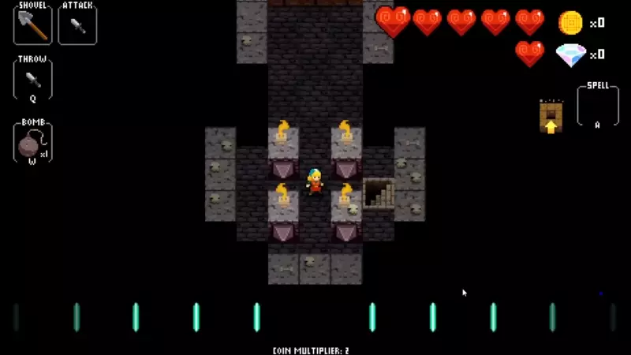
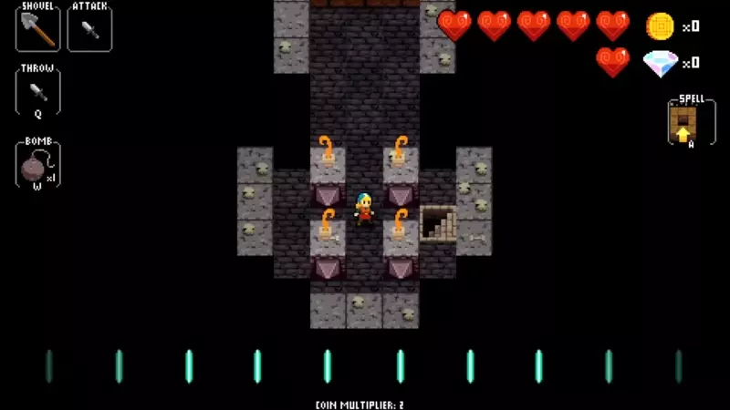
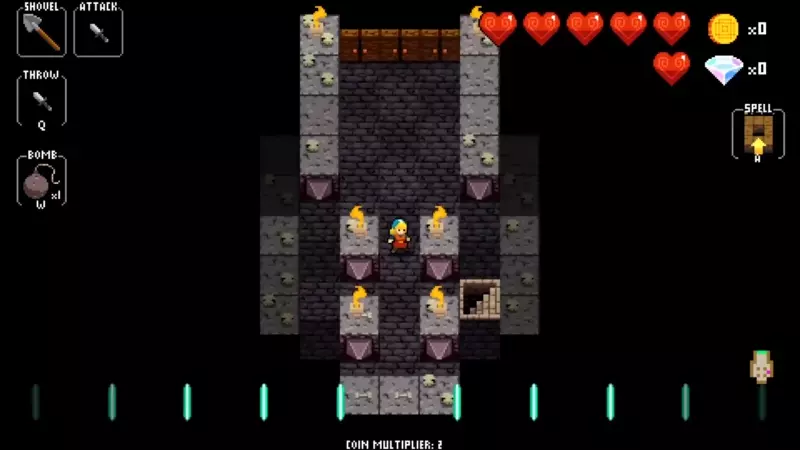

# Earth kills on Death Metal

## Death Metal 1

There are 3 different strats for DM1 depending on what height the ghosts are at.

### Ghost 2 rows below Death Metal

Enter aligned with DM.  You may have to buffer 0-3 times on his body,
depending on how far the ghost is.

### Ghost 3 rows below Death Metal

Enter aligned with DM.  Get the ghost to follow you,
then walk around DM until he puts himself between you and the ghost.
Depending on how far the ghost is, the walk has a slightly different shape.

### Ghost 1 row below Death Metal

Enter 1 column offset from DM, between him and the ghost.
Only works if the ghost isn't too far away.
Use this strat only when you can't use one of the others.

## Death Metal 2/5

These strats work fine for both DM2 and DM5.

### Single Earth, slower

Enter aligned with DM.

### Double Earth, faster

Enter one column offset from DM.  It's possible for a clone to get in the way,
in which case you can react and fall back to a slightly slower version:

## Death Metal 3/4, Double Earth

These strats work fine for both DM3 and DM4.

Enter aligned with DM.  Wait for a beetle to be adjacent to him
(and ready to move), then dig upwards and Earth again.
It's possible for both of the lower beetles to end up in bad positions,
in which case you can wait for the top beetles instead:

